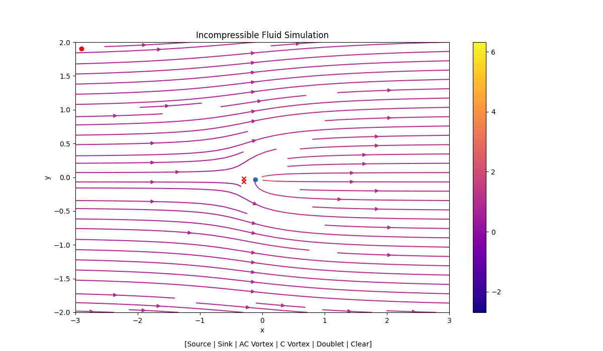
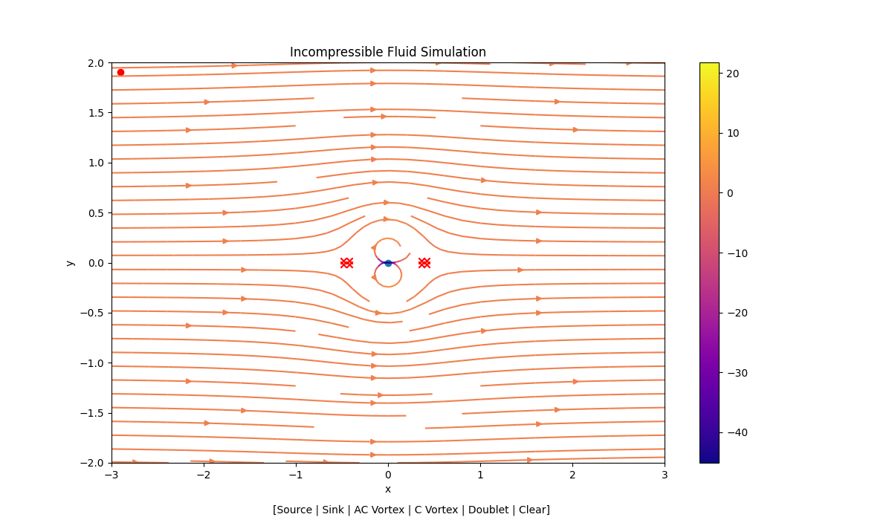
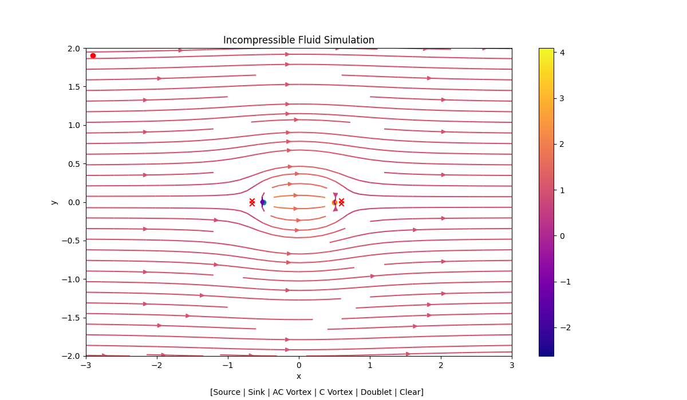

# Incompressible Fluid Simulation in Matplotlib
Whipped up a streamline simulation using potential energy equations I just learned in AVDASI 1. 
Since you can run Python code on iOS now, I can make these graphs in realtime during lectures :) .

### Types of Components Available
The following components can be added to the graph either in code or clicking on the graph itself:
* Sources
* Sinks
* Vortices (both clockwise and anticlockwise)
* Doublets

In code, you can add components on the `sources = []` line. To operate the graph, there are 6 clicks per refresh. 
Note at the bottom there are 6 sequential options. The first click will place a source, second a sink, etc. 
The 6th click (Clear), will remove all components from the graph, returning it to initial conditions. 
**If you wish to not place a certain component down, 
clicking between the top left corner and the red dot will ignore the input.**

### Stagnation Points
Stagnation points are automatically plotted on the graph (depicted by the red 'x' marks). The tolerance can be changed,
as points are searched for and not calculated directly (resulting in multiple points on the graph).

### Body Selection [WIP]
Ideally you should be able to either define bodies or select a number of streamlines to use as a body. This 
would be extremely helpful in visualizing flow around an object.

***
## Examples

#### Single Source in Uniform Flow `[Source(1, 0, 0)]`

#### Doublet in UF (Cylinder) `[Doublet(1, 0, 0)]`

#### Source and Sink in UF (Rakine Oval) `[Source(1, -0.5, 0), Source(-1, 0.5, 0)]`
